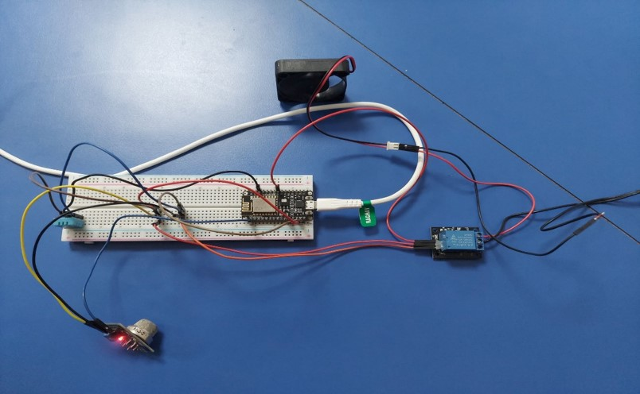

# Iot_Project
In order to integrate the hardwares for the system at first all of the required hardwares should be collected. All of the hardwares required for this system are as;
1.	Node MCU
2.	DHT 11
3.	MQ 2 sensor
4. Fan
5. Relay 
6. Jumper Wires
7. Bread board

The circuit diagram of the system is presented as;

